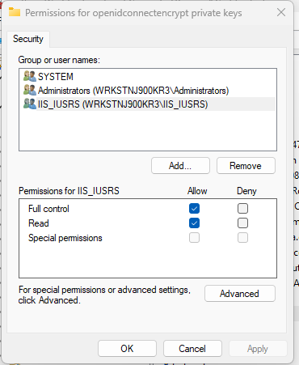

# Computing

## Bullets

When writing a bulleted list, don't make a single bullet item wrap more than a single line. If it is more, make it a paragraph instead.

## Certificate Permission

For IIS to have access to the certificate. Add IIS_IUSRS to the permission group.

## Git

If you're resurrecting a branch that has already been merged into develop or has not yet had a commit, update the branch by using the fast forward option.
